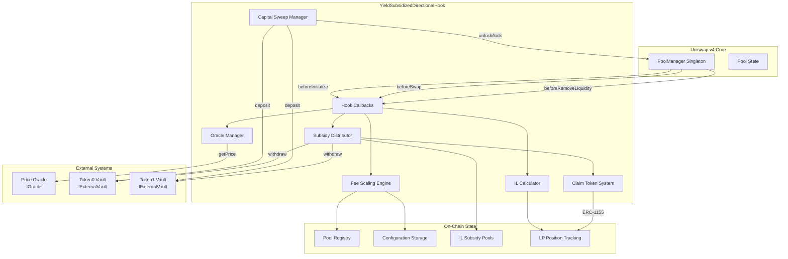
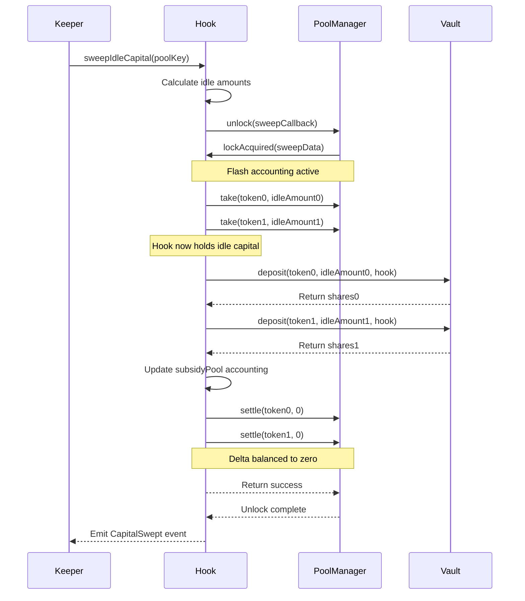
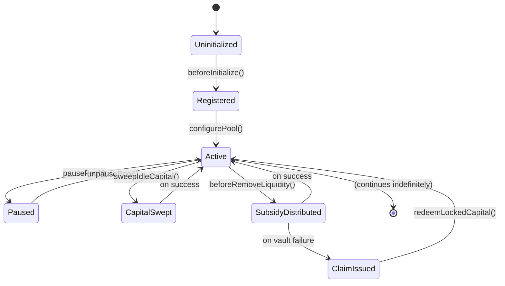

# Design Document: Yield Subsidized Directional Hook

## Overview

The Yield Subsidized Directional Hook is a sophisticated Uniswap v4 hook that addresses the fundamental challenge of LP profitability through three integrated mechanisms:

1. **Directional Fee Scaling**: Dynamically adjusts swap fees based on oracle price comparison to tax toxic arbitrage flow
2. **External Yield Generation**: Sweeps out-of-range idle capital to ERC-4626 vaults for yield farming
3. **IL Subsidy Distribution**: Compensates LPs for impermanent loss using accumulated yield

This design integrates with Uniswap v4's singleton architecture, leveraging flash accounting for efficient capital management and hook callbacks for lifecycle integration.

### Core Design Principles

- **Security-First**: All callbacks enforce strict access control; external calls are gas-limited and gracefully handled
- **Gas Efficiency**: O(1) operations in swap path; no loops or unbounded iterations
- **Composability**: ERC-4626 vault compatibility; multi-pool support from single contract
- **Fail-Safe Operation**: Vault failures don't block LP withdrawals; claim tokens ensure capital recovery
- **Economic Soundness**: Fee scaling calibrated to cover IL without breaking pool competitiveness

### Integration Context

The hook operates within Uniswap v4's architecture:
- Inherits from `BaseHook` (@uniswap/v4-periphery)
- Implements `IHooks` interface callbacks
- Interacts with `PoolManager` singleton for all pool operations
- Uses flash accounting (unlock/lock pattern) for atomic multi-step operations


## Architecture

### High-Level System Architecture



### Contract Structure

The hook follows a modular internal architecture with specialized components:

- **Hook Callbacks Layer**: Entry points for PoolManager interactions
- **Oracle Manager**: Fetches and caches external price feeds
- **Fee Scaling Engine**: Computes dynamic fees based on flow toxicity
- **Capital Sweep Manager**: Orchestrates flash accounting for vault deposits
- **IL Calculator**: Measures impermanent loss for LP positions
- **Subsidy Distributor**: Allocates yield to LPs proportional to IL
- **Claim Token System**: ERC-1155 implementation for locked capital redemption


## Components and Interfaces

### Smart Contract Interfaces

#### IOracle Interface

```solidity
/// @notice External price oracle interface for directional fee calculation
/// @dev Must return manipulation-resistant prices with staleness checks
interface IOracle {
    /// @notice Returns the current price for a token pair
    /// @param token0 The base token address
    /// @param token1 The quote token address
    /// @return price The price expressed as token1 per token0 in fixed-point format
    /// @return timestamp The timestamp of the price observation
    function getPrice(address token0, address token1) 
        external 
        view 
        returns (uint256 price, uint256 timestamp);
}
```

**Oracle Requirements**:
- Must return prices in a consistent fixed-point format (e.g., 18 decimals)
- Timestamp must be block.timestamp or recent to enable staleness detection
- Should implement TWAP or other manipulation-resistant pricing
- Revert behavior should be handled gracefully by the hook


#### IExternalVault Interface

```solidity
/// @notice ERC-4626 compatible yield vault interface
/// @dev Vaults must support standard deposit/withdraw operations
interface IExternalVault {
    /// @notice Returns the address of the underlying token
    function asset() external view returns (address);
    
    /// @notice Deposits assets into the vault
    /// @param assets The amount of underlying tokens to deposit
    /// @param receiver The address to receive vault shares
    /// @return shares The amount of vault shares minted
    function deposit(uint256 assets, address receiver) 
        external 
        returns (uint256 shares);
    
    /// @notice Withdraws assets from the vault
    /// @param assets The amount of underlying tokens to withdraw
    /// @param receiver The address to receive underlying tokens
    /// @param owner The address that owns the vault shares
    /// @return shares The amount of vault shares burned
    function withdraw(uint256 assets, address receiver, address owner) 
        external 
        returns (uint256 shares);
    
    /// @notice Converts vault shares to underlying asset amount
    /// @param shares The amount of vault shares
    /// @return assets The corresponding amount of underlying tokens
    function convertToAssets(uint256 shares) 
        external 
        view 
        returns (uint256 assets);
    
    /// @notice Returns the total assets managed by the vault
    function totalAssets() external view returns (uint256);
}
```


**Vault Integration Considerations**:
- Hook validates `asset()` matches expected token address on configuration
- Deposit operations use `address(this)` as receiver to custody vault shares
- Withdraw failures are caught and handled via claim token minting
- Share-to-asset conversion is used for real-time yield calculation

### Core Data Structures

#### Pool Registry

```solidity
/// @notice Tracks registered pools and their initialization status
/// @dev Prevents callback spoofing by validating pool existence
mapping(PoolId => bool) public registeredPools;

/// @notice Maps PoolId to pool-specific configuration
mapping(PoolId => PoolConfig) public poolConfigs;

struct PoolConfig {
    address oracle;              // Price oracle for directional fee calculation
    address vault0;              // Yield vault for token0
    address vault1;              // Yield vault for token1
    uint24 baseFeeBps;           // Baseline fee in basis points
    uint24 maxFeeMultiplier;     // Maximum fee multiplier (e.g., 300 = 3x)
    uint24 deviationThresholdBps; // Price deviation threshold for toxic flow classification
    bool isPaused;               // Emergency pause flag
}
```


#### IL Subsidy Pool

```solidity
/// @notice Accumulates yield for IL compensation per pool
struct SubsidyPool {
    uint256 totalToken0Yield;     // Accumulated yield in token0
    uint256 totalToken1Yield;     // Accumulated yield in token1
    uint256 totalToken0Principal; // Principal locked in vault for token0
    uint256 totalToken1Principal; // Principal locked in vault for token1
    uint256 vaultShares0;         // Vault shares held for token0
    uint256 vaultShares1;         // Vault shares held for token1
}

/// @notice Maps PoolId to its subsidy pool accounting
mapping(PoolId => SubsidyPool) public subsidyPools;
```

**Accounting Logic**:
- `totalYield = convertToAssets(vaultShares) - totalPrincipal`
- Yield is calculated on-demand during subsidy distribution
- Principal tracks the original deposited amounts (excluding yield)
- Vault shares are the actual custody instrument


#### LP Position Tracking

```solidity
/// @notice Tracks LP position data for IL calculation
struct LPPosition {
    uint256 token0Initial;       // Initial token0 deposited
    uint256 token1Initial;       // Initial token1 deposited
    uint160 sqrtPriceX96Initial; // Pool price at deposit time
    int24 tickLower;             // Lower tick of position
    int24 tickUpper;             // Upper tick of position
    uint256 liquidityAmount;     // Liquidity amount in pool units
    uint256 lastUpdateTimestamp; // Last modification timestamp
}

/// @notice Maps LP address to their positions per pool
/// @dev Supports multiple positions per LP per pool via nested mapping
mapping(address => mapping(PoolId => mapping(uint256 => LPPosition))) public lpPositions;

/// @notice Tracks number of positions per LP per pool
mapping(address => mapping(PoolId => uint256)) public lpPositionCount;
```

**Position Management**:
- Positions are created during liquidity addition (tracked off-hook via event indexing)
- Position data is read during `beforeRemoveLiquidity` for IL calculation
- Multiple positions per LP are supported but require external indexing
- Simplified implementation may track aggregate position per LP per pool


#### Claim Token System

```solidity
/// @notice ERC-1155 token ID structure for locked capital claims
/// @dev Token ID encodes: poolId (bytes32) + tokenIndex (uint8)
/// Token ID = uint256(keccak256(abi.encodePacked(poolId, tokenIndex)))

/// @notice Metadata for each claim token type
struct ClaimTokenMetadata {
    PoolId poolId;               // Associated pool
    address vaultAddress;        // Vault holding the locked capital
    address underlyingToken;     // Token type (token0 or token1)
    uint256 totalLockedAmount;   // Total principal locked in vault
}

/// @notice Maps claim token ID to its metadata
mapping(uint256 => ClaimTokenMetadata) public claimTokenMetadata;

/// @notice Tracks individual LP locked amounts per claim token
mapping(uint256 => mapping(address => uint256)) public lpLockedAmounts;
```

**Claim Token Lifecycle**:
1. Minted when vault withdrawal fails during `beforeRemoveLiquidity`
2. Token ID uniquely identifies pool + vault + token combination
3. LPs hold claim tokens representing proportional locked capital
4. Redeemed when vault liquidity becomes available via `redeemLockedCapital()`
5. Burning claim tokens transfers underlying from vault to LP


## Directional Fee Scaling Mechanism

### Flow Classification Algorithm

The hook classifies swap flow as toxic or benign by analyzing price movement:

```solidity
function classifyFlow(
    PoolKey calldata key,
    bool zeroForOne,
    int256 amountSpecified
) internal view returns (bool isToxic, uint24 feeMultiplier) {
    // 1. Fetch oracle price with staleness check
    (uint256 oraclePrice, uint256 timestamp) = getOraclePrice(key);
    if (block.timestamp - timestamp > ORACLE_STALENESS_THRESHOLD) {
        return (false, poolConfigs[key.toId()].baseFeeBps);
    }
    
    // 2. Get current pool price from Slot0
    uint160 currentSqrtPriceX96 = poolManager.getSlot0(key.toId()).sqrtPriceX96;
    uint256 currentPrice = sqrtPriceX96ToPrice(currentSqrtPriceX96);
    
    // 3. Estimate post-swap price
    uint160 estimatedSqrtPriceX96 = estimatePostSwapPrice(
        key, currentSqrtPriceX96, amountSpecified, zeroForOne
    );
    uint256 estimatedPrice = sqrtPriceX96ToPrice(estimatedSqrtPriceX96);
    
    // 4. Calculate price deviation
    uint256 deviationFromOracle = calculateDeviation(estimatedPrice, oraclePrice);
    uint256 deviationThreshold = poolConfigs[key.toId()].deviationThresholdBps;
    
    // 5. Classify as toxic if moving away from oracle
    bool movingAwayFromOracle = isMovingAway(currentPrice, estimatedPrice, oraclePrice);
    isToxic = movingAwayFromOracle && (deviationFromOracle > deviationThreshold);
    
    // 6. Calculate fee multiplier if toxic
    feeMultiplier = isToxic 
        ? calculateFeeMultiplier(deviationFromOracle, poolConfigs[key.toId()])
        : poolConfigs[key.toId()].baseFeeBps;
}
```


### Price Movement Direction Logic

```solidity
function isMovingAway(
    uint256 currentPrice,
    uint256 estimatedPrice,
    uint256 oraclePrice
) internal pure returns (bool) {
    uint256 currentDeviation = currentPrice > oraclePrice 
        ? currentPrice - oraclePrice 
        : oraclePrice - currentPrice;
    
    uint256 estimatedDeviation = estimatedPrice > oraclePrice 
        ? estimatedPrice - oraclePrice 
        : oraclePrice - estimatedPrice;
    
    // Toxic if post-swap deviation increases
    return estimatedDeviation > currentDeviation;
}
```

### Fee Scaling Curve

The fee multiplier increases with price deviation magnitude:

```solidity
function calculateFeeMultiplier(
    uint256 deviationBps,
    PoolConfig memory config
) internal pure returns (uint24) {
    // Linear scaling: multiplier = 1.0 + (deviation / maxDeviation) * (maxMultiplier - 1.0)
    uint256 scaleFactor = (deviationBps * 10000) / config.deviationThresholdBps;
    uint256 multiplier = 10000 + (scaleFactor * (config.maxFeeMultiplier - 10000)) / 10000;
    
    // Cap at maximum
    return uint24(multiplier > config.maxFeeMultiplier ? config.maxFeeMultiplier : multiplier);
}
```

**Example Calibration**:
- Baseline fee: 30 bps (0.3%)
- Deviation threshold: 50 bps (0.5%)
- Max multiplier: 3x
- Swap with 1% deviation: `fee = 30 bps * 3 = 90 bps (0.9%)`


### beforeSwap Implementation

```solidity
function beforeSwap(
    address,
    PoolKey calldata key,
    IPoolManager.SwapParams calldata params,
    bytes calldata
) external override onlyPoolManager returns (bytes4, BeforeSwapDelta, uint24) {
    // Access control
    PoolId poolId = key.toId();
    if (!registeredPools[poolId]) revert PoolNotRegistered();
    
    // Skip if paused
    if (poolConfigs[poolId].isPaused) {
        return (this.beforeSwap.selector, BeforeSwapDeltaLibrary.ZERO_DELTA, 0);
    }
    
    // Classify flow and calculate dynamic fee
    (bool isToxic, uint24 feeOverride) = classifyFlow(key, params.zeroForOne, params.amountSpecified);
    
    // Emit event for analytics
    emit DirectionalFeeApplied(poolId, params.zeroForOne, isToxic, feeOverride);
    
    // Return fee override
    return (this.beforeSwap.selector, BeforeSwapDeltaLibrary.ZERO_DELTA, feeOverride);
}
```


## Flash Accounting Flow for Capital Sweeps

Capital sweeps use Uniswap v4's flash accounting pattern via `unlock/lock`:

### Sweep Execution Flow




### Implementation

```solidity
function sweepIdleCapital(PoolKey calldata key) external nonReentrant {
    PoolId poolId = key.toId();
    if (!registeredPools[poolId]) revert PoolNotRegistered();
    if (poolConfigs[poolId].isPaused) revert Paused();
    
    // Calculate idle capital
    (uint256 idleAmount0, uint256 idleAmount1) = calculateIdleCapital(key);
    
    // Check minimum threshold
    if (idleAmount0 < MIN_SWEEP_THRESHOLD && idleAmount1 < MIN_SWEEP_THRESHOLD) {
        revert BelowMinimumSweepThreshold();
    }
    
    // Encode sweep parameters
    bytes memory data = abi.encode(poolId, key, idleAmount0, idleAmount1);
    
    // Execute via flash accounting
    poolManager.unlock(data);
}

function unlockCallback(bytes calldata rawData) external returns (bytes memory) {
    require(msg.sender == address(poolManager), "Only PoolManager");
    
    (PoolId poolId, PoolKey memory key, uint256 amount0, uint256 amount1) = 
        abi.decode(rawData, (PoolId, PoolKey, uint256, uint256));
    
    // Withdraw from pool
    if (amount0 > 0) {
        poolManager.take(key.currency0, address(this), amount0);
    }
    if (amount1 > 0) {
        poolManager.take(key.currency1, address(this), amount1);
    }
    
    // Deposit to vaults
    PoolConfig memory config = poolConfigs[poolId];
    uint256 shares0;
    uint256 shares1;
    
    if (amount0 > 0 && config.vault0 != address(0)) {
        Currency.wrap(key.currency0).approve(config.vault0, amount0);
        shares0 = IExternalVault(config.vault0).deposit(amount0, address(this));
    }
    if (amount1 > 0 && config.vault1 != address(0)) {
        Currency.wrap(key.currency1).approve(config.vault1, amount1);
        shares1 = IExternalVault(config.vault1).deposit(amount1, address(this));
    }
    
    // Update subsidy pool accounting
    SubsidyPool storage pool = subsidyPools[poolId];
    pool.totalToken0Principal += amount0;
    pool.totalToken1Principal += amount1;
    pool.vaultShares0 += shares0;
    pool.vaultShares1 += shares1;
    
    // Settle deltas (no tokens returned to pool)
    poolManager.settle(key.currency0);
    poolManager.settle(key.currency1);
    
    emit CapitalSwept(poolId, amount0, amount1, shares0, shares1, msg.sender);
    
    return "";
}
```


## IL Calculation and Subsidy Distribution

### Impermanent Loss Calculation

IL represents the opportunity cost of providing liquidity versus holding tokens:

```solidity
function calculateImpermanentLoss(
    LPPosition memory position,
    uint160 currentSqrtPriceX96
) internal pure returns (uint256 ilToken0, uint256 ilToken1) {
    // Convert prices to comparable format
    uint256 initialPrice = sqrtPriceX96ToPrice(position.sqrtPriceX96Initial);
    uint256 currentPrice = sqrtPriceX96ToPrice(currentSqrtPriceX96);
    
    // Calculate current token amounts in the position
    (uint256 currentToken0, uint256 currentToken1) = calculateTokenAmounts(
        position.liquidityAmount,
        position.tickLower,
        position.tickUpper,
        currentSqrtPriceX96
    );
    
    // Calculate hold value at current price
    uint256 holdValueInToken0 = position.token0Initial + 
        (position.token1Initial * 1e18) / currentPrice;
    
    // Calculate position value at current price
    uint256 positionValueInToken0 = currentToken0 + 
        (currentToken1 * 1e18) / currentPrice;
    
    // IL is the difference (if positive, LP has loss)
    if (holdValueInToken0 > positionValueInToken0) {
        uint256 ilInToken0 = holdValueInToken0 - positionValueInToken0;
        
        // Distribute IL proportionally to token0 and token1
        uint256 priceRatio = (currentPrice * 1e18) / (currentPrice + 1e18);
        ilToken0 = (ilInToken0 * priceRatio) / 1e18;
        ilToken1 = ((ilInToken0 - ilToken0) * currentPrice) / 1e18;
    } else {
        // No IL if position is profitable
        ilToken0 = 0;
        ilToken1 = 0;
    }
}
```


### Subsidy Distribution Logic

When LPs remove liquidity, the hook compensates IL from the subsidy pool:

```solidity
function beforeRemoveLiquidity(
    address,
    PoolKey calldata key,
    IPoolManager.ModifyLiquidityParams calldata params,
    bytes calldata
) external override onlyPoolManager returns (bytes4) {
    PoolId poolId = key.toId();
    if (!registeredPools[poolId]) revert PoolNotRegistered();
    
    // Get LP position data
    address lp = tx.origin; // or derive from params
    LPPosition memory position = lpPositions[lp][poolId][0];
    
    // Calculate IL
    uint160 currentSqrtPriceX96 = poolManager.getSlot0(poolId).sqrtPriceX96;
    (uint256 ilToken0, uint256 ilToken1) = calculateImpermanentLoss(position, currentSqrtPriceX96);
    
    // Skip if no IL
    if (ilToken0 == 0 && ilToken1 == 0) {
        return this.beforeRemoveLiquidity.selector;
    }
    
    // Calculate available subsidy
    SubsidyPool storage pool = subsidyPools[poolId];
    uint256 availableYield0 = calculateAvailableYield(poolId, true);
    uint256 availableYield1 = calculateAvailableYield(poolId, false);
    
    // Cap subsidy at lesser of IL or available yield
    uint256 subsidy0 = ilToken0 > availableYield0 ? availableYield0 : ilToken0;
    uint256 subsidy1 = ilToken1 > availableYield1 ? availableYield1 : ilToken1;
    
    // Withdraw from vault if needed
    if (subsidy0 > 0) {
        withdrawFromVault(key, poolId, true, subsidy0);
    }
    if (subsidy1 > 0) {
        withdrawFromVault(key, poolId, false, subsidy1);
    }
    
    // Update subsidy pool
    pool.totalToken0Yield -= subsidy0;
    pool.totalToken1Yield -= subsidy1;
    
    // Emit event
    emit ILSubsidyDistributed(
        poolId,
        lp,
        ilToken0,
        ilToken1,
        subsidy0,
        subsidy1,
        subsidy0 < ilToken0 || subsidy1 < ilToken1 // partial coverage
    );
    
    return this.beforeRemoveLiquidity.selector;
}
```


### Vault Withdrawal with Claim Token Fallback

```solidity
function withdrawFromVault(
    PoolKey memory key,
    PoolId poolId,
    bool isToken0,
    uint256 amount
) internal {
    PoolConfig memory config = poolConfigs[poolId];
    address vault = isToken0 ? config.vault0 : config.vault1;
    Currency currency = isToken0 ? key.currency0 : key.currency1;
    
    if (vault == address(0)) return;
    
    try IExternalVault(vault).withdraw(amount, address(this), address(this)) returns (uint256) {
        // Success: tokens now in hook, will be added to LP withdrawal via BalanceDelta
        SubsidyPool storage pool = subsidyPools[poolId];
        if (isToken0) {
            pool.totalToken0Principal -= amount;
        } else {
            pool.totalToken1Principal -= amount;
        }
    } catch {
        // Failure: mint claim token to LP
        address lp = tx.origin;
        uint256 claimTokenId = generateClaimTokenId(poolId, currency);
        
        // Initialize metadata if first time
        if (claimTokenMetadata[claimTokenId].poolId == PoolId.wrap(bytes32(0))) {
            claimTokenMetadata[claimTokenId] = ClaimTokenMetadata({
                poolId: poolId,
                vaultAddress: vault,
                underlyingToken: Currency.unwrap(currency),
                totalLockedAmount: 0
            });
        }
        
        // Mint claim token
        _mint(lp, claimTokenId, amount, "");
        claimTokenMetadata[claimTokenId].totalLockedAmount += amount;
        lpLockedAmounts[claimTokenId][lp] += amount;
        
        emit ClaimTokenMinted(lp, claimTokenId, amount, vault);
    }
}
```


### Claim Token Redemption

```solidity
function redeemLockedCapital(uint256 claimTokenId, uint256 amount) external nonReentrant {
    // Verify ownership
    if (balanceOf(msg.sender, claimTokenId) < amount) revert InsufficientClaimBalance();
    
    ClaimTokenMetadata memory metadata = claimTokenMetadata[claimTokenId];
    if (metadata.poolId == PoolId.wrap(bytes32(0))) revert InvalidClaimToken();
    
    // Attempt vault withdrawal
    uint256 withdrawnShares = IExternalVault(metadata.vaultAddress).withdraw(
        amount,
        msg.sender,
        address(this)
    );
    
    // Burn claim tokens
    _burn(msg.sender, claimTokenId, amount);
    claimTokenMetadata[claimTokenId].totalLockedAmount -= amount;
    lpLockedAmounts[claimTokenId][msg.sender] -= amount;
    
    emit ClaimTokenRedeemed(msg.sender, claimTokenId, amount, withdrawnShares);
}
```


## Claim Token System (ERC-1155)

### Design Rationale

Claim tokens enable non-blocking liquidity removal when external vaults cannot immediately return capital:

- **ERC-1155** allows multiple token types (one per pool-vault-token combination)
- **Token ID Encoding**: `uint256(keccak256(abi.encodePacked(poolId, tokenIndex)))`
- **Fungible within type**: All claim tokens for the same vault/token are interchangeable
- **Metadata tracking**: Links token IDs to vault addresses and locked amounts

### Token ID Generation

```solidity
function generateClaimTokenId(PoolId poolId, Currency currency) internal pure returns (uint256) {
    uint8 tokenIndex = Currency.unwrap(currency) < Currency.unwrap(currency) ? 0 : 1;
    return uint256(keccak256(abi.encodePacked(poolId, tokenIndex)));
}
```

### ERC-1155 Implementation

The hook inherits from OpenZeppelin's ERC1155 and overrides transfer restrictions:

```solidity
contract YieldSubsidizedDirectionalHook is BaseHook, ERC1155, ReentrancyGuard {
    constructor(IPoolManager _poolManager) BaseHook(_poolManager) ERC1155("") {
        // Initialize
    }
    
    // Override to allow claim token transfers between LPs
    function _beforeTokenTransfer(
        address operator,
        address from,
        address to,
        uint256[] memory ids,
        uint256[] memory amounts,
        bytes memory data
    ) internal virtual override {
        // Update lpLockedAmounts tracking
        for (uint256 i = 0; i < ids.length; i++) {
            if (from != address(0)) {
                lpLockedAmounts[ids[i]][from] -= amounts[i];
            }
            if (to != address(0)) {
                lpLockedAmounts[ids[i]][to] += amounts[i];
            }
        }
    }
}
```


## Security Architecture

### Access Control

The hook implements multi-level access control:

```solidity
/// @notice Restricts callbacks to PoolManager only
modifier onlyPoolManager() {
    if (msg.sender != address(poolManager)) revert UnauthorizedCaller();
    _;
}

/// @notice Restricts administrative functions to owner
address public owner;

modifier onlyOwner() {
    if (msg.sender != owner) revert Unauthorized();
    _;
}

function transferOwnership(address newOwner) external onlyOwner {
    require(newOwner != address(0), "Invalid address");
    address oldOwner = owner;
    owner = newOwner;
    emit OwnershipTransferred(oldOwner, newOwner);
}
```

**Access Control Matrix**:
| Function | Access Level | Enforcement |
|----------|-------------|-------------|
| beforeInitialize | PoolManager | onlyPoolManager modifier |
| beforeSwap | PoolManager | onlyPoolManager modifier |
| beforeRemoveLiquidity | PoolManager | onlyPoolManager modifier |
| sweepIdleCapital | Public | None (permissionless) |
| redeemLockedCapital | Public | None (owner validation via ERC1155) |
| configurePool | Admin | onlyOwner modifier |
| setOracle | Admin | onlyOwner modifier |
| setVault | Admin | onlyOwner modifier |
| pause/unpause | Admin | onlyOwner modifier |


### Reentrancy Protection

Critical state-changing functions are protected:

```solidity
import "@openzeppelin/contracts/security/ReentrancyGuard.sol";

contract YieldSubsidizedDirectionalHook is BaseHook, ERC1155, ReentrancyGuard {
    function sweepIdleCapital(PoolKey calldata key) 
        external 
        nonReentrant 
    {
        // Implementation
    }
    
    function redeemLockedCapital(uint256 claimTokenId, uint256 amount) 
        external 
        nonReentrant 
    {
        // Implementation
    }
    
    // Administrative functions also use nonReentrant
    function configurePool(PoolId poolId, PoolConfig calldata config) 
        external 
        onlyOwner 
        nonReentrant 
    {
        // Implementation
    }
}
```

**Reentrancy Risk Points**:
- External vault calls (`deposit`, `withdraw`)
- Oracle price queries (`getPrice`)
- ERC1155 transfer hooks
- Flash accounting callbacks (`unlockCallback`)

**Mitigation Strategy**:
- Use OpenZeppelin's ReentrancyGuard for external-facing functions
- Follow checks-effects-interactions pattern
- Update state before external calls
- Gas limit external calls to prevent griefing


### Integer Overflow Protection

The hook uses Solidity 0.8.26+ for automatic overflow checking:

```solidity
pragma solidity ^0.8.26;

// Arithmetic operations are automatically checked
function updateSubsidyPool(PoolId poolId, uint256 yieldAmount) internal {
    subsidyPools[poolId].totalToken0Yield += yieldAmount; // Reverts on overflow
}

// For unchecked operations (where overflow is intentional), use unchecked block
function calculateTokenId(PoolId poolId, uint8 tokenIndex) internal pure returns (uint256) {
    unchecked {
        return uint256(keccak256(abi.encodePacked(poolId, tokenIndex)));
    }
}
```

**Critical Arithmetic Operations**:
- Subsidy pool balance updates: checked arithmetic
- Fee multiplier calculations: bounds validation before multiplication
- Price conversions: validate intermediate results fit in uint256
- Share-to-asset conversions: use safe division with zero checks


### Price Manipulation Resistance

Oracle integration includes manipulation safeguards:

```solidity
uint256 constant ORACLE_STALENESS_THRESHOLD = 5 minutes;
uint256 constant MAX_PRICE_DEVIATION = 5000; // 50% max deviation from recent average

function getOraclePriceWithValidation(PoolKey memory key) 
    internal 
    view 
    returns (uint256 price, bool isValid) 
{
    try IOracle(poolConfigs[key.toId()].oracle).getPrice(
        Currency.unwrap(key.currency0),
        Currency.unwrap(key.currency1)
    ) returns (uint256 oraclePrice, uint256 timestamp) {
        // Check staleness
        if (block.timestamp - timestamp > ORACLE_STALENESS_THRESHOLD) {
            return (0, false);
        }
        
        // Check price sanity against pool price
        uint160 poolSqrtPrice = poolManager.getSlot0(key.toId()).sqrtPriceX96;
        uint256 poolPrice = sqrtPriceX96ToPrice(poolSqrtPrice);
        
        uint256 deviation = oraclePrice > poolPrice 
            ? ((oraclePrice - poolPrice) * 10000) / poolPrice
            : ((poolPrice - oraclePrice) * 10000) / poolPrice;
        
        if (deviation > MAX_PRICE_DEVIATION) {
            return (0, false);
        }
        
        return (oraclePrice, true);
    } catch {
        return (0, false);
    }
}
```

**Protection Mechanisms**:
- Staleness checks: reject prices older than threshold
- Sanity bounds: reject prices deviating excessively from pool price
- Graceful fallback: disable directional scaling if oracle fails
- TWAP recommendation: oracle implementations should use time-weighted averages


### Gas Limit Safety for External Calls

External contract calls are gas-limited to prevent griefing:

```solidity
uint256 constant ORACLE_GAS_LIMIT = 100_000;
uint256 constant VAULT_GAS_LIMIT = 300_000;

function safeOracleCall(address oracle, address token0, address token1) 
    internal 
    view 
    returns (uint256 price, uint256 timestamp, bool success) 
{
    try IOracle(oracle).getPrice{gas: ORACLE_GAS_LIMIT}(token0, token1) 
        returns (uint256 p, uint256 t) 
    {
        return (p, t, true);
    } catch {
        return (0, 0, false);
    }
}

function safeVaultDeposit(address vault, uint256 amount) 
    internal 
    returns (uint256 shares, bool success) 
{
    try IExternalVault(vault).deposit{gas: VAULT_GAS_LIMIT}(amount, address(this)) 
        returns (uint256 s) 
    {
        return (s, true);
    } catch {
        return (0, false);
    }
}
```

**Gas Allocation Strategy**:
- Oracle calls: 100k gas (sufficient for TWAP calculations)
- Vault deposits: 300k gas (sufficient for ERC-4626 operations)
- Vault withdrawals: 300k gas (may include queue processing)
- Failed calls emit events for monitoring but don't revert transactions


### Emergency Pause Mechanism

Critical operations can be paused during incidents:

```solidity
mapping(PoolId => bool) public isPaused;

function pausePool(PoolId poolId) external onlyOwner {
    isPaused[poolId] = true;
    emit PoolPaused(poolId, msg.sender);
}

function unpausePool(PoolId poolId) external onlyOwner {
    isPaused[poolId] = false;
    emit PoolUnpaused(poolId, msg.sender);
}

// Pause affects non-critical operations
function beforeSwap(...) external override onlyPoolManager returns (...) {
    if (isPaused[poolId]) {
        // Apply baseline fee only, no directional scaling
        return (this.beforeSwap.selector, BeforeSwapDeltaLibrary.ZERO_DELTA, poolConfigs[poolId].baseFeeBps);
    }
    // Normal operation
}

function sweepIdleCapital(PoolKey calldata key) external nonReentrant {
    PoolId poolId = key.toId();
    if (isPaused[poolId]) revert PoolPaused();
    // Normal operation
}

// LP withdrawals always allowed (even when paused)
function beforeRemoveLiquidity(...) external override onlyPoolManager returns (...) {
    // IL subsidy disabled when paused, but withdrawal proceeds
    if (isPaused[poolId]) {
        return this.beforeRemoveLiquidity.selector;
    }
    // Normal operation with subsidy
}
```

**Pause Behavior**:
- Swaps continue with baseline fees (no directional scaling)
- Capital sweeps are blocked
- Claim token redemptions are blocked
- LP withdrawals always succeed (no subsidies when paused)
- Configuration changes still permitted (to fix issues)


## Event System

### Comprehensive Event Definitions

```solidity
/// @notice Emitted when a pool is registered during beforeInitialize
event PoolRegistered(PoolId indexed poolId, address oracle, address vault0, address vault1);

/// @notice Emitted when directional fee scaling is applied
event DirectionalFeeApplied(
    PoolId indexed poolId,
    bool zeroForOne,
    bool isToxic,
    uint24 feeMultiplier,
    uint256 oraclePrice,
    uint256 poolPrice
);

/// @notice Emitted when idle capital is swept to external vaults
event CapitalSwept(
    PoolId indexed poolId,
    uint256 amount0,
    uint256 amount1,
    uint256 shares0,
    uint256 shares1,
    address indexed caller
);

/// @notice Emitted when IL subsidy is distributed to an LP
event ILSubsidyDistributed(
    PoolId indexed poolId,
    address indexed lp,
    uint256 ilToken0,
    uint256 ilToken1,
    uint256 subsidyToken0,
    uint256 subsidyToken1,
    bool partialCoverage
);

/// @notice Emitted when claim tokens are minted due to vault withdrawal failure
event ClaimTokenMinted(
    address indexed lp,
    uint256 indexed claimTokenId,
    uint256 amount,
    address vault
);

/// @notice Emitted when claim tokens are redeemed for underlying capital
event ClaimTokenRedeemed(
    address indexed lp,
    uint256 indexed claimTokenId,
    uint256 amount,
    uint256 sharesRedeemed
);

/// @notice Emitted when pool configuration is updated
event PoolConfigured(
    PoolId indexed poolId,
    address oracle,
    address vault0,
    address vault1,
    uint24 baseFeeBps,
    uint24 maxFeeMultiplier,
    uint24 deviationThresholdBps
);

/// @notice Emitted when a pool is paused
event PoolPaused(PoolId indexed poolId, address indexed admin);

/// @notice Emitted when a pool is unpaused
event PoolUnpaused(PoolId indexed poolId, address indexed admin);

/// @notice Emitted when ownership is transferred
event OwnershipTransferred(address indexed previousOwner, address indexed newOwner);
```


### Event Usage Patterns

**Analytics and Monitoring**:
- Index `DirectionalFeeApplied` to track toxic flow patterns
- Monitor `CapitalSwept` for optimal keeper trigger timing
- Track `ILSubsidyDistributed` to measure LP compensation effectiveness
- Alert on `ClaimTokenMinted` events as indicators of vault illiquidity

**Subgraph Integration**:
```graphql
type DirectionalFeeEvent @entity {
  id: ID!
  poolId: Bytes!
  timestamp: BigInt!
  blockNumber: BigInt!
  zeroForOne: Boolean!
  isToxic: Boolean!
  feeMultiplier: BigInt!
  oraclePrice: BigInt!
  poolPrice: BigInt!
}

type SubsidyDistribution @entity {
  id: ID!
  poolId: Bytes!
  lp: Bytes!
  timestamp: BigInt!
  ilToken0: BigInt!
  ilToken1: BigInt!
  subsidyToken0: BigInt!
  subsidyToken1: BigInt!
  partialCoverage: Boolean!
}
```


## State Management Strategy

### Storage Layout

```solidity
contract YieldSubsidizedDirectionalHook is BaseHook, ERC1155, ReentrancyGuard {
    // ============ Immutable State ============
    IPoolManager public immutable poolManager;
    
    // ============ Mutable State ============
    address public owner;
    
    // Pool registry and configuration
    mapping(PoolId => bool) public registeredPools;
    mapping(PoolId => PoolConfig) public poolConfigs;
    mapping(PoolId => bool) public isPaused;
    
    // Subsidy pool accounting
    mapping(PoolId => SubsidyPool) public subsidyPools;
    
    // LP position tracking
    mapping(address => mapping(PoolId => mapping(uint256 => LPPosition))) public lpPositions;
    mapping(address => mapping(PoolId => uint256)) public lpPositionCount;
    
    // Claim token system
    mapping(uint256 => ClaimTokenMetadata) public claimTokenMetadata;
    mapping(uint256 => mapping(address => uint256)) public lpLockedAmounts;
    
    // Oracle price cache (transient storage in future)
    mapping(PoolId => CachedOraclePrice) private _oraclePriceCache;
    
    struct CachedOraclePrice {
        uint256 price;
        uint256 timestamp;
        uint256 cachedAt; // block.number
    }
}
```


### Gas Optimization Strategies

**Storage Access Patterns**:
- Cache frequently accessed values (PoolConfig) in memory during callback execution
- Use storage pointers for struct updates to avoid multiple SLOAD/SSTORE operations
- Pack related fields into single storage slots where possible

**Example Optimized Function**:
```solidity
function beforeSwap(...) external override returns (...) {
    PoolId poolId = key.toId();
    
    // Single SLOAD for entire config struct
    PoolConfig memory config = poolConfigs[poolId];
    
    // Work with memory copy
    if (config.isPaused) {
        return (this.beforeSwap.selector, BeforeSwapDeltaLibrary.ZERO_DELTA, config.baseFeeBps);
    }
    
    // Reuse cached config for all calculations
    (bool isToxic, uint24 fee) = classifyFlowWithConfig(key, params, config);
    
    return (this.beforeSwap.selector, BeforeSwapDeltaLibrary.ZERO_DELTA, fee);
}
```

**Struct Packing**:
```solidity
// Optimized: fits in 2 storage slots
struct PoolConfig {
    address oracle;              // 20 bytes (slot 0)
    uint24 baseFeeBps;           // 3 bytes (slot 0)
    uint24 maxFeeMultiplier;     // 3 bytes (slot 0)
    uint24 deviationThresholdBps; // 3 bytes (slot 0)
    bool isPaused;               // 1 byte (slot 0)
    // Total slot 0: 20 + 3 + 3 + 3 + 1 = 30 bytes (2 bytes unused)
    
    address vault0;              // 20 bytes (slot 1)
    address vault1;              // 20 bytes (slot 2)
}
```


### State Transitions



**State Invariants**:
- `registeredPools[poolId] == true` ⟹ `poolConfigs[poolId]` exists
- `subsidyPools[poolId].vaultShares0 >= 0` (always non-negative)
- `subsidyPools[poolId].totalToken0Yield <= convertToAssets(vaultShares0)` (yield <= vault value)
- `claimTokenMetadata[tokenId].totalLockedAmount == sum(lpLockedAmounts[tokenId])` (total equals sum)


## Data Models

### Complete Type Definitions

```solidity
// ============ Core Structs ============

struct PoolConfig {
    address oracle;
    address vault0;
    address vault1;
    uint24 baseFeeBps;
    uint24 maxFeeMultiplier;
    uint24 deviationThresholdBps;
    bool isPaused;
}

struct SubsidyPool {
    uint256 totalToken0Yield;
    uint256 totalToken1Yield;
    uint256 totalToken0Principal;
    uint256 totalToken1Principal;
    uint256 vaultShares0;
    uint256 vaultShares1;
}

struct LPPosition {
    uint256 token0Initial;
    uint256 token1Initial;
    uint160 sqrtPriceX96Initial;
    int24 tickLower;
    int24 tickUpper;
    uint256 liquidityAmount;
    uint256 lastUpdateTimestamp;
}

struct ClaimTokenMetadata {
    PoolId poolId;
    address vaultAddress;
    address underlyingToken;
    uint256 totalLockedAmount;
}

// ============ Custom Errors ============

error UnauthorizedCaller();
error Unauthorized();
error PoolNotRegistered();
error PoolAlreadyRegistered();
error PoolPaused();
error InvalidConfiguration();
error BelowMinimumSweepThreshold();
error InsufficientClaimBalance();
error InvalidClaimToken();
error OracleCallFailed();
error VaultCallFailed();
error DeltaNotBalanced();
```

