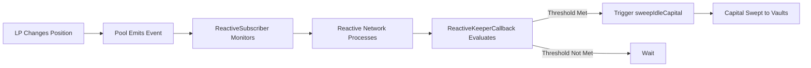

# 🚀 Reactive Network Integration - Quick Start

## ✅ What Was Added

The project now includes **fully automated, decentralized keeper operations** via Reactive Network integration:

### 📦 New Files Created

1. **Automation Contracts**
   - `src/automation/ReactiveKeeperCallback.sol` - Executes automated sweeps on Reactive Network
   - `src/automation/ReactiveSubscriber.sol` - Monitors pool events on origin chain
   - `src/interfaces/IYieldSubsidizedDirectionalHook.sol` - Hook interface for automation

2. **Deployment & Configuration**
   - `script/DeployReactiveAutomation.s.sol` - Deployment script for automation contracts
   - `.env.example` - Environment configuration template
   - `remappings.txt` - Dependency remappings including Reactive Network

3. **Documentation**
   - `docs/REACTIVE_NETWORK_INTEGRATION.md` - Comprehensive 400+ line integration guide
   - Updated `README.md` with Reactive Network features
   - Updated `PROGRESS_REPORT.md` with Phase 6 completion

### 📚 Dependencies Added

```bash
# Reactive Network libraries installed
lib/reactive-smart-contract-demos/
lib/reactive-lib/  # via submodule
```

---

## 🎯 How It Works



### Key Benefits

✅ **No Centralized Infrastructure** - Fully decentralized automation  
✅ **Event-Driven** - Triggers on actual liquidity changes  
✅ **Cost-Efficient** - Only executes when profitable  
✅ **Configurable** - Adjust thresholds and intervals  
✅ **Transparent** - All operations on-chain and auditable  

---

## 🚀 Quick Start Guide

### 1. Configure Environment

```bash
# Copy environment template
cp .env.example .env

# Edit .env with your values
vim .env
```

Required variables:
```bash
REACTIVE_SERVICE_ADDRESS=0x...  # Reactive Network service
HOOK_ADDRESS=0x...              # Your deployed hook
SWEEP_THRESHOLD=1000000000000000000  # 1 token minimum
SWEEP_INTERVAL=3600  # 1 hour
PRIVATE_KEY=0x...
```

### 2. Deploy Automation

```bash
# Deploy callback (on Reactive Network)
forge script script/DeployReactiveAutomation.s.sol \
    --rpc-url $REACTIVE_NETWORK_RPC_URL \
    --broadcast

# Deploy subscriber (on origin chain)
forge script script/DeployReactiveAutomation.s.sol \
    --rpc-url $ORIGIN_CHAIN_RPC_URL \
    --broadcast
```

### 3. Configure Parameters

```bash
# Set sweep threshold (e.g., 2 ETH)
cast send $CALLBACK_ADDRESS \
    "setSweepThreshold(uint256)" 2000000000000000000 \
    --private-key $PRIVATE_KEY

# Set minimum interval (e.g., 2 hours)
cast send $CALLBACK_ADDRESS \
    "setMinSweepInterval(uint256)" 7200 \
    --private-key $PRIVATE_KEY
```

### 4. Monitor Automation

```bash
# Watch for automated sweeps
cast logs --address $CALLBACK_ADDRESS \
    --event "SweepTriggered(bytes32,uint256,uint256)" \
    --follow
```

---

## 📖 Full Documentation

For detailed information, see:

- **[Reactive Network Integration Guide](docs/REACTIVE_NETWORK_INTEGRATION.md)** - Complete 400+ line guide with:
  - Detailed architecture diagrams
  - Full deployment instructions
  - Configuration best practices
  - Monitoring and troubleshooting
  - Gas optimization strategies
  - Security considerations
  - Advanced features

---

## 🎓 Contract Overview

### ReactiveKeeperCallback (Reactive Network)

**Purpose**: Evaluates sweep conditions and executes automated sweeps

**Key Functions**:
- `react()` - Reactive Network callback triggered by events
- `setSweepThreshold()` - Configure minimum idle capital
- `setMinSweepInterval()` - Configure timing between sweeps
- `canSweep()` - Check if pool is ready for sweep

**Configuration**:
- `sweepThreshold` - Minimum idle capital to trigger (default: 1 token)
- `minSweepInterval` - Minimum time between sweeps (default: 1 hour)

### ReactiveSubscriber (Origin Chain)

**Purpose**: Monitors hook events and forwards to Reactive Network

**Key Functions**:
- `react()` - Forwards events to callback contract
- `subscribeToTopic()` - Add new event subscriptions
- `setCallbackContract()` - Update callback address

**Monitored Events**:
- `LiquidityModified` - Tracks LP position changes
- `IdleCapitalDetected` - Identifies idle capital opportunities

---

## 🔧 Customization Examples

### High-Value Pool (Conservative)

```bash
# 10 ETH minimum, 12 hour intervals
cast send $CALLBACK "setSweepThreshold(uint256)" 10000000000000000000
cast send $CALLBACK "setMinSweepInterval(uint256)" 43200
```

### Active Pool (Aggressive)

```bash
# 0.5 ETH minimum, 30 minute intervals
cast send $CALLBACK "setSweepThreshold(uint256)" 500000000000000000
cast send $CALLBACK "setMinSweepInterval(uint256)" 1800
```

### Stable Pool (Balanced)

```bash
# 2 ETH minimum, 4 hour intervals
cast send $CALLBACK "setSweepThreshold(uint256)" 2000000000000000000
cast send $CALLBACK "setMinSweepInterval(uint256)" 14400
```

---

## 📊 Cost-Benefit Analysis

**Example Calculation**:

```
Idle Capital: 10 ETH
Vault APY: 5%
Time Period: 24 hours
Gas Cost: 200,000 gas @ 30 gwei

Daily Yield = 10 × 0.05 / 365 = 0.00137 ETH ≈ $3.42 @ $2,500/ETH
Automation Cost = 30 × 10^-9 × 200,000 × 2,500 = $0.015

Net Benefit = $3.42 - $0.015 = $3.40 ✅ Profitable!
```

**Rule of Thumb**: Automation is profitable when:
```
idleCapital × vaultAPY × timePeriod > gasPrice × gasUsed × ETH_PRICE
```

---

## 🛠️ Troubleshooting

### Common Issues

**"Subscription failed"**
- Ensure ReactiveSubscriber has native tokens for Reactive Network fees

**"SweepTooSoon"**
- Wait for `minSweepInterval` to pass since last sweep

**"Unauthorized"**
- Verify Reactive Network service address is correct

### Testing Locally

```solidity
// Simulate Reactive Network trigger in tests
vm.prank(reactiveService);
callback.react(topics, data, originChainId, hookAddress);
```

---

## 📞 Resources

- **Integration Guide**: [docs/REACTIVE_NETWORK_INTEGRATION.md](docs/REACTIVE_NETWORK_INTEGRATION.md)
- **Reactive Network Docs**: https://docs.reactive.network
- **Reactive GitHub**: https://github.com/Reactive-Network
- **Hook Repository**: https://github.com/precious-akpan/yield-subsidized-directional-hook

---

## ✨ What's Next?

1. **Deploy to Testnet** - Test automation in real conditions
2. **Monitor Performance** - Track sweep frequency and profitability
3. **Optimize Parameters** - Tune thresholds based on pool activity
4. **Scale to Multiple Pools** - Same automation handles multiple pools

---

**Last Updated**: June 8, 2026  
**Version**: 1.0.0  
**Status**: ✅ Ready for Deployment

🎉 **Your hook now has fully automated, decentralized keeper operations!**
