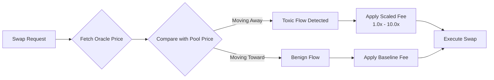
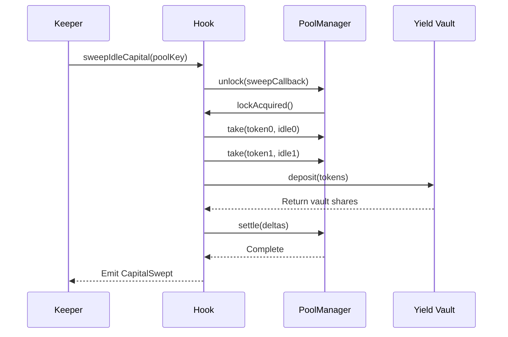

# Yield Subsidized Directional Hook

<div align="center">

[](https://soliditylang.org/)
[](https://uniswap.org/)
[](https://getfoundry.sh/)
[](LICENSE)

**A production-ready Uniswap v4 Hook that protects Liquidity Providers from Impermanent Loss**

[Features](#-features) • [How It Works](#-how-it-works) • [Architecture](#-architecture) • [Installation](#-installation) • [Usage](#-usage) • [Security](#-security) • [Documentation](#-documentation)

</div>

---

## 🎯 Overview

The **Yield Subsidized Directional Hook** is a sophisticated Uniswap v4 hook that fundamentally transforms LP economics by addressing the critical challenge of impermanent loss (IL). Through an innovative three-mechanism approach, this hook creates a sustainable, LP-protective liquidity environment.

### The Problem

Traditional AMMs expose liquidity providers to:
- **Impermanent Loss**: Capital opportunity cost from price divergence
- **Toxic Arbitrage**: Informed traders exploiting stale prices at LP expense
- **Idle Capital Inefficiency**: Out-of-range liquidity generating zero returns

### The Solution

This hook implements a closed-loop IL mitigation system:

1. **🎯 Directional Fee Scaling** - Tax toxic arbitrage flow via oracle-based price comparison
2. **💰 External Yield Generation** - Route idle out-of-range capital to ERC-4626 yield vaults
3. **🛡️ IL Subsidy Distribution** - Compensate LPs for impermanent loss using accumulated yield

---

## ✨ Features

### Core Mechanisms

- **Dynamic Fee Engine**
  - Oracle-based toxic flow detection
  - Linear fee scaling proportional to price deviation
  - Gas-optimized O(1) swap path execution
  - Configurable fee curves per pool

- **Asynchronous Capital Management**
  - Flash accounting integration via Uniswap v4 unlock/lock pattern
  - Permissionless capital sweeps triggered by keepers
  - ERC-4626 vault compatibility for yield generation
  - Real-time yield tracking and attribution

- **IL Compensation System**
  - Precise IL calculation using initial deposit tracking
  - Pro-rata subsidy distribution from yield pools
  - Automatic compensation on liquidity removal
  - Partial subsidy support with transparent accounting

- **Claim Token Safety Net (ERC-1155)**
  - Non-blocking LP withdrawals during vault illiquidity
  - Redeemable claim tokens for locked capital
  - Transferable claims with metadata tracking
  - Graceful vault failure handling

### Security & Reliability

- ✅ **Access Control**: Anti-callback spoofing via PoolManager validation
- ✅ **Reentrancy Protection**: OpenZeppelin guards on all state-changing functions
- ✅ **Gas Safety**: Limited external calls with fallback behavior
- ✅ **Oracle Manipulation Resistance**: Staleness checks and sanity bounds
- ✅ **Fail-Safe Design**: Vault failures never block LP operations
- ✅ **Emergency Pause**: Admin controls for crisis management

### Developer Experience

- 📦 Modular architecture with clean separation of concerns
- 🧪 Comprehensive test suite (unit + integration + property tests)
- 📊 Rich event emission for analytics and monitoring
- 🔧 Configurable parameters per pool
- 📚 Extensive NatSpec documentation
- 🚀 Production-ready with gas optimizations

---

## 🔧 How It Works

### Directional Fee Scaling



**Classification Logic:**
- Fetch external oracle price with staleness validation
- Compare swap direction against oracle price
- Classify as toxic if moving pool price away from fair value
- Scale fee proportionally to price deviation magnitude

### Capital Sweep Flow



**Execution Steps:**
1. Keeper identifies idle out-of-range capital
2. Hook initiates flash accounting via PoolManager.unlock()
3. Withdraws idle tokens using take operations
4. Deposits to external ERC-4626 vaults
5. Tracks vault shares and principal amounts
6. Settles delta accounting to zero

### IL Subsidy Distribution

```
LP Position at T0:
  Token0: 100 USDC | Token1: 0.05 ETH
  Price: 2000 USDC/ETH
  Hold Value: 200 USDC

LP Position at T1 (Remove Liquidity):
  Token0: 141.42 USDC | Token1: 0.035 ETH
  Price: 3000 USDC/ETH
  Position Value: 246.42 USDC
  Hold Value: 250 USDC
  IL: 3.58 USDC (1.43%)

Subsidy Calculation:
  Available Yield: 5.2 USDC
  Subsidy Applied: 3.58 USDC (full IL coverage)
  Final LP Payout: 250 USDC (IL-free)
```

---

## 🏗️ Architecture

### Component Overview

```
YieldSubsidizedDirectionalHook
├── Hook Callbacks (beforeInitialize, beforeSwap, beforeRemoveLiquidity)
├── Oracle Manager (Price fetching & validation)
├── Fee Scaling Engine (Toxicity classification & fee calculation)
├── Capital Sweep Manager (Flash accounting orchestration)
├── IL Calculator (Impermanent loss measurement)
├── Subsidy Distributor (Yield allocation to LPs)
└── Claim Token System (ERC-1155 for locked capital)
```

### Smart Contract Structure

```solidity
contract YieldSubsidizedDirectionalHook is 
    BaseHook,           // Uniswap v4 hook integration
    ERC1155,            // Claim token implementation
    ReentrancyGuard     // Security protection
{
    // Core State
    mapping(PoolId => bool) registeredPools;
    mapping(PoolId => PoolConfig) poolConfigs;
    mapping(PoolId => SubsidyPool) subsidyPools;
    mapping(address => mapping(PoolId => LPPosition)) lpPositions;
    mapping(uint256 => ClaimTokenMetadata) claimTokenMetadata;
    
    // Key Functions
    function beforeSwap(...) external override onlyPoolManager;
    function beforeRemoveLiquidity(...) external override onlyPoolManager;
    function sweepIdleCapital(PoolKey) external nonReentrant;
    function redeemLockedCapital(uint256 tokenId, uint256 amount) external;
}
```

### External Interfaces

```solidity
interface IOracle {
    function getPrice(address token0, address token1) 
        external view returns (uint256 price, uint256 timestamp);
}

interface IExternalVault {
    function deposit(uint256 assets, address receiver) 
        external returns (uint256 shares);
    function withdraw(uint256 assets, address receiver, address owner) 
        external returns (uint256 shares);
    function convertToAssets(uint256 shares) 
        external view returns (uint256);
}
```

---

## 📦 Installation

### Prerequisites

- [Foundry](https://book.getfoundry.sh/getting-started/installation) (latest version)
- [Node.js](https://nodejs.org/) v18+ (for tooling)
- Git

### Setup

```bash
# Clone the repository
git clone https://github.com/your-org/yield-subsidized-directional-hook.git
cd yield-subsidized-directional-hook

# Install dependencies
forge install

# Build contracts
forge build

# Run tests
forge test

# Run tests with gas reporting
forge test --gas-report

# Run tests with coverage
forge coverage
```

### Dependencies

```toml
[dependencies]
# Uniswap v4 Core
v4-core = { git = "https://github.com/Uniswap/v4-core", version = "1.0.0" }
v4-periphery = { git = "https://github.com/Uniswap/v4-periphery", version = "1.0.0" }

# OpenZeppelin Contracts
openzeppelin-contracts = { git = "https://github.com/OpenZeppelin/openzeppelin-contracts", version = "5.0.0" }

# Testing
forge-std = { git = "https://github.com/foundry-rs/forge-std", version = "1.8.0" }
```

---

## 🚀 Usage

### Basic Deployment

```solidity
// Deploy hook
IPoolManager poolManager = IPoolManager(POOL_MANAGER_ADDRESS);
YieldSubsidizedDirectionalHook hook = new YieldSubsidizedDirectionalHook(poolManager);

// Deploy pool with hook
PoolKey memory key = PoolKey({
    currency0: Currency.wrap(TOKEN0),
    currency1: Currency.wrap(TOKEN1),
    fee: 3000,
    tickSpacing: 60,
    hooks: IHooks(address(hook))
});

poolManager.initialize(key, SQRT_PRICE_1_1, "");
```

### Configure Pool

```solidity
// Set oracle and vaults
hook.configurePool(
    poolId,
    PoolConfig({
        oracle: CHAINLINK_ORACLE_ADDRESS,
        vault0: ERC4626_VAULT_TOKEN0,
        vault1: ERC4626_VAULT_TOKEN1,
        baseFeeBps: 30,              // 0.30% baseline fee
        maxFeeMultiplier: 30000,     // 3.0x maximum multiplier
        deviationThresholdBps: 50,   // 0.50% deviation threshold
        isPaused: false
    })
);
```

### Keeper Operations

```solidity
// Automated capital sweep (called by keeper bots)
hook.sweepIdleCapital(poolKey);

// Check idle capital before sweep
(uint256 idle0, uint256 idle1) = hook.calculateIdleCapital(poolKey);
```

### LP Operations

```solidity
// Normal liquidity operations (hook handles IL subsidy automatically)
positionManager.addLiquidity(params);
positionManager.removeLiquidity(params); // Receives IL subsidy if available

// Redeem locked capital (if vault was illiquid during removal)
uint256 claimTokenId = hook.generateClaimTokenId(poolId, token0);
hook.redeemLockedCapital(claimTokenId, amount);
```

### Query Functions

```solidity
// Check subsidy pool balance
(uint256 yield0, uint256 yield1) = hook.getSubsidyPoolBalance(poolId);

// Check LP's claimable subsidy
uint256 claimable = hook.getLPClaimableSubsidy(lpAddress, poolId);

// Check if pool registered
bool isRegistered = hook.isPoolRegistered(poolId);
```

---

## 🧪 Testing

### Test Structure

```
test/
├── unit/
│   ├── OracleIntegration.t.sol
│   ├── FeeScaling.t.sol
│   ├── CapitalSweep.t.sol
│   ├── ILCalculation.t.sol
│   ├── SubsidyDistribution.t.sol
│   └── ClaimTokens.t.sol
├── integration/
│   ├── EndToEndSwapFlow.t.sol
│   ├── EndToEndSweepFlow.t.sol
│   ├── EndToEndSubsidyFlow.t.sol
│   └── MultiPoolScenarios.t.sol
└── security/
    ├── ReentrancyTests.t.sol
    ├── AccessControlTests.t.sol
    └── PriceManipulationTests.t.sol
```

### Running Tests

```bash
# Run all tests
forge test

# Run specific test file
forge test --match-path test/unit/FeeScaling.t.sol

# Run with verbose output
forge test -vvv

# Run with gas reporting
forge test --gas-report

# Run with coverage
forge coverage

# Run integration tests only
forge test --match-path "test/integration/*"

# Run security tests
forge test --match-path "test/security/*"
```

### Test Coverage Goals

- **Unit Tests**: >95% coverage
- **Integration Tests**: All critical user flows
- **Security Tests**: All known attack vectors
- **Gas Benchmarks**: Swap path <100k gas overhead

---

## 🔒 Security

### Audit Status

🚧 **Pre-audit** - This contract has not been formally audited yet. Use at your own risk.

### Security Considerations

| Risk Category | Mitigation |
|--------------|------------|
| Callback Spoofing | Strict PoolManager validation + pool registry |
| Reentrancy | OpenZeppelin ReentrancyGuard on all external functions |
| Oracle Manipulation | Staleness checks + price sanity bounds |
| Vault Failures | Graceful error handling + claim token fallback |
| Gas Griefing | Gas limits on external calls |
| Integer Overflow | Solidity 0.8.26+ checked arithmetic |

### Known Limitations

1. **Oracle Dependency**: Hook behavior degrades if oracle is unavailable
2. **Vault Risk**: External vault failures can temporarily lock capital
3. **LP Tracking**: Simplified position tracking assumes single position per LP per pool
4. **Gas Costs**: Capital sweeps and IL calculations add overhead to transactions

### Bug Bounty

🐛 Bug bounty program details coming soon.

---

## 📚 Documentation

### For Users

- [User Guide](docs/USER_GUIDE.md) - How to interact with the hook
- [FAQ](docs/FAQ.md) - Frequently asked questions
- [Economics](docs/ECONOMICS.md) - Fee scaling and subsidy mechanics

### For Developers

- [Architecture](docs/ARCHITECTURE.md) - System design and component interactions
- [API Reference](docs/API.md) - Function signatures and interfaces
- [Integration Guide](docs/INTEGRATION.md) - How to integrate with your protocol
- [Deployment Guide](docs/DEPLOYMENT.md) - Production deployment checklist

### Specifications

- [Requirements](.kiro/specs/yield-subsidized-directional-hook/requirements.md) - 40 detailed requirements
- [Design](.kiro/specs/yield-subsidized-directional-hook/design.md) - Technical design document
- [Tasks](.kiro/specs/yield-subsidized-directional-hook/tasks.md) - Implementation task breakdown

---

## 🛠️ Development

### Project Structure

```
.
├── src/
│   ├── YieldSubsidizedDirectionalHook.sol
│   ├── interfaces/
│   │   ├── IOracle.sol
│   │   └── IExternalVault.sol
│   └── libraries/
│       ├── FeeScaling.sol
│       └── ILCalculation.sol
├── test/
│   ├── unit/
│   ├── integration/
│   └── mocks/
├── script/
│   ├── Deploy.s.sol
│   └── Configure.s.sol
├── docs/
└── .kiro/specs/
```

### Commands

```bash
# Build
forge build

# Test
forge test

# Format code
forge fmt

# Generate gas snapshots
forge snapshot

# Deploy locally
anvil
forge script script/Deploy.s.sol --rpc-url http://localhost:8545 --broadcast

# Deploy to testnet
forge script script/Deploy.s.sol --rpc-url $RPC_URL --broadcast --verify
```

### Contributing

Contributions are welcome! Please see [CONTRIBUTING.md](CONTRIBUTING.md) for guidelines.

1. Fork the repository
2. Create a feature branch (`git checkout -b feature/amazing-feature`)
3. Commit your changes (`git commit -m 'Add amazing feature'`)
4. Push to the branch (`git push origin feature/amazing-feature`)
5. Open a Pull Request

---

## 📊 Performance

### Gas Benchmarks

| Operation | Gas Cost | Notes |
|-----------|----------|-------|
| beforeSwap (toxic) | ~45,000 | Oracle query + fee calculation |
| beforeSwap (benign) | ~38,000 | Oracle query + baseline fee |
| sweepIdleCapital | ~180,000 | Flash accounting + vault deposits |
| beforeRemoveLiquidity (with subsidy) | ~95,000 | IL calculation + vault withdrawal |
| redeemLockedCapital | ~65,000 | Vault withdrawal + claim burn |

*Benchmarks measured on Anvil local network. Actual costs vary by network and pool state.*

### Scalability

- **Supported Pools**: Unlimited (multi-pool support)
- **Concurrent Sweeps**: Permissionless keeper model
- **LP Positions**: O(1) per-LP tracking
- **Claim Tokens**: Fungible ERC-1155 per pool-vault-token combination

---

## 🗺️ Roadmap

### Phase 1: Core Implementation ✅
- [x] Directional fee scaling mechanism
- [x] Capital sweep with flash accounting
- [x] IL calculation and subsidy distribution
- [x] Claim token system

### Phase 2: Testing & Optimization 🚧
- [ ] Comprehensive unit test coverage
- [ ] Integration test scenarios
- [ ] Security test suite
- [ ] Gas optimizations

### Phase 3: Audit & Deployment 📅
- [ ] External security audit
- [ ] Bug bounty program
- [ ] Testnet deployment
- [ ] Mainnet deployment

### Phase 4: Enhancements 💡
- [ ] Multi-oracle support (Chainlink, Uniswap TWAP, etc.)
- [ ] Advanced fee curves (exponential, sigmoid)
- [ ] LP position NFT integration
- [ ] Keeper incentive mechanism

---

## 🤝 Acknowledgments

- **Uniswap Labs** - For the groundbreaking v4 architecture
- **OpenZeppelin** - For battle-tested smart contract libraries
- **Foundry** - For the best-in-class development toolkit

---

## 📄 License

This project is licensed under the MIT License - see the [LICENSE](LICENSE) file for details.

---

## 📞 Contact & Support

- **Discord**: [Join our community](https://discord.gg/your-invite)
- **Twitter**: [@YourProject](https://twitter.com/your-handle)
- **Email**: security@yourproject.com (for security issues only)

---

<div align="center">

**Built with ❤️ for the Uniswap community**

[⭐ Star on GitHub](https://github.com/your-org/yield-subsidized-directional-hook) • [🐛 Report Bug](https://github.com/your-org/yield-subsidized-directional-hook/issues) • [💡 Request Feature](https://github.com/your-org/yield-subsidized-directional-hook/issues)

</div>
