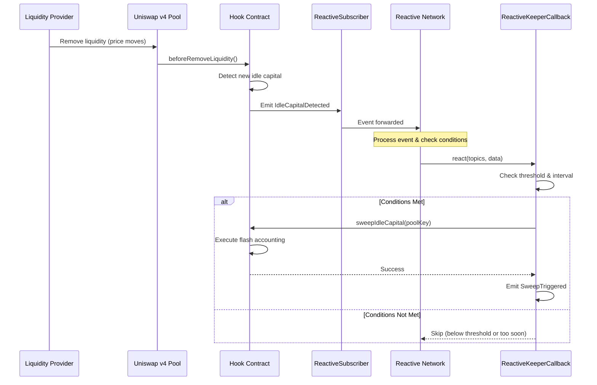

# Reactive Network Integration

## Overview

The Yield Subsidized Directional Hook integrates with [Reactive Network](https://reactive.network) to provide **automated, decentralized keeper operations** for capital sweeps and vault management. This eliminates the need for centralized bot infrastructure while ensuring optimal yield generation timing.

## Architecture

### Component Overview

```mermaid
graph TB
    subgraph "Origin Chain (Ethereum/L2)"
        HOOK[YieldSubsidizedDirectionalHook]
        SUB[ReactiveSubscriber]
        POOL[Uniswap v4 Pool]
    end
    
    subgraph "Reactive Network"
        RVM[Reactive Virtual Machine]
        CB[ReactiveKeeperCallback]
    end
    
    POOL -->|LiquidityModified Event| HOOK
    HOOK -->|IdleCapitalDetected Event| SUB
    SUB -->|Subscribe & Monitor| RVM
    RVM -->|Trigger react()| CB
    CB -->|sweepIdleCapital()| HOOK
    
    style RVM fill:#e1f5ff
    style CB fill:#ffe1e1
    style SUB fill:#e1ffe1
```

### Contracts

1. **ReactiveSubscriber** (Origin Chain)
   - Monitors hook events (LiquidityModified, IdleCapitalDetected)
   - Subscribes to events via Reactive Network
   - Forwards relevant events to callback contract

2. **ReactiveKeeperCallback** (Reactive Network)
   - Receives event notifications from Reactive Network
   - Evaluates sweep conditions (threshold, interval)
   - Executes `sweepIdleCapital()` when conditions are met

3. **YieldSubsidizedDirectionalHook** (Origin Chain)
   - Emits `IdleCapitalDetected` events for monitoring
   - Processes automated sweep requests from callback

## How It Works

### 1. Event Monitoring

The system monitors two types of events:

```solidity
// Emitted when LP positions change
event LiquidityModified(
    bytes32 indexed poolId,
    address indexed owner,
    int24 tickLower,
    int24 tickUpper,
    int256 liquidityDelta
);

// Emitted when idle capital is detected
event IdleCapitalDetected(
    bytes32 indexed poolId,
    uint256 idleAmount0,
    uint256 idleAmount1
);
```

### 2. Automated Trigger Flow



### 3. Sweep Conditions

The callback triggers a sweep when:

1. **Threshold Met**: `idleAmount0 >= sweepThreshold` OR `idleAmount1 >= sweepThreshold`
2. **Interval Passed**: `block.timestamp >= lastSweepTime + minSweepInterval`
3. **Pool Active**: Pool is registered and not paused

## Deployment Guide

### Prerequisites

1. Deploy the main hook contract first
2. Obtain Reactive Network service address for your target chain
3. Fund deployer address on both origin chain and Reactive Network

### Environment Variables

Create a `.env` file:

```bash
# Network Configuration
ORIGIN_CHAIN_RPC_URL=https://eth-mainnet.g.alchemy.com/v2/YOUR_KEY
REACTIVE_NETWORK_RPC_URL=https://reactive-rpc.example.com
REACTIVE_SERVICE_ADDRESS=0x...  # Reactive Network service contract

# Contract Addresses
HOOK_ADDRESS=0x...  # Your deployed hook contract

# Automation Parameters
SWEEP_THRESHOLD=1000000000000000000  # 1 token (18 decimals)
SWEEP_INTERVAL=3600  # 1 hour in seconds

# Deployment
PRIVATE_KEY=0x...
```

### Step-by-Step Deployment

#### 1. Deploy on Reactive Network (Callback)

```bash
# Deploy callback contract
forge script script/DeployReactiveAutomation.s.sol:DeployReactiveAutomation \
    --rpc-url $REACTIVE_NETWORK_RPC_URL \
    --broadcast \
    --verify
```

#### 2. Deploy on Origin Chain (Subscriber)

```bash
# Deploy subscriber contract
forge script script/DeployReactiveAutomation.s.sol:DeployReactiveAutomation \
    --rpc-url $ORIGIN_CHAIN_RPC_URL \
    --broadcast \
    --verify
```

#### 3. Verify Deployment

```solidity
// Check callback configuration
cast call $CALLBACK_ADDRESS "sweepThreshold()" --rpc-url $REACTIVE_NETWORK_RPC_URL
cast call $CALLBACK_ADDRESS "minSweepInterval()" --rpc-url $REACTIVE_NETWORK_RPC_URL

// Check subscriber subscriptions
cast call $SUBSCRIBER_ADDRESS "hookAddress()" --rpc-url $ORIGIN_CHAIN_RPC_URL
cast call $SUBSCRIBER_ADDRESS "callbackContract()" --rpc-url $ORIGIN_CHAIN_RPC_URL
```

## Configuration

### Adjusting Sweep Threshold

The sweep threshold determines the minimum idle capital required to trigger automation:

```bash
# Update threshold (1 ETH = 1e18 wei)
cast send $CALLBACK_ADDRESS \
    "setSweepThreshold(uint256)" 2000000000000000000 \
    --private-key $PRIVATE_KEY \
    --rpc-url $REACTIVE_NETWORK_RPC_URL
```

**Recommended thresholds**:
- **High-value pools**: 10+ ETH to cover gas costs
- **Medium-value pools**: 1-5 ETH for balanced automation
- **Low-value pools**: 0.1-1 ETH for frequent sweeps

### Adjusting Sweep Interval

The sweep interval prevents excessive automation and gas costs:

```bash
# Update interval (1 hour = 3600 seconds)
cast send $CALLBACK_ADDRESS \
    "setMinSweepInterval(uint256)" 7200 \
    --private-key $PRIVATE_KEY \
    --rpc-url $REACTIVE_NETWORK_RPC_URL
```

**Recommended intervals**:
- **High-volatility pools**: 30 minutes to 1 hour
- **Stable pools**: 4-12 hours
- **Low-activity pools**: 24 hours

## Monitoring

### View Current Status

```bash
# Check if pool can be swept
cast call $CALLBACK_ADDRESS \
    "canSweep(bytes32)" $POOL_ID \
    --rpc-url $REACTIVE_NETWORK_RPC_URL

# Get last sweep time
cast call $CALLBACK_ADDRESS \
    "lastSweepTime(bytes32)" $POOL_ID \
    --rpc-url $REACTIVE_NETWORK_RPC_URL
```

### Event Monitoring

Monitor automation events:

```bash
# Watch for automated sweeps
cast logs --address $CALLBACK_ADDRESS \
    --event "SweepTriggered(bytes32,uint256,uint256)" \
    --rpc-url $REACTIVE_NETWORK_RPC_URL \
    --follow
```

### Integration with Indexers

Use The Graph or other indexers to track automation performance:

```graphql
{
  sweepTriggers(first: 10, orderBy: timestamp, orderDirection: desc) {
    id
    poolId
    idleAmount0
    idleAmount1
    timestamp
    blockNumber
  }
}
```

## Gas Optimization

### Callback Gas Costs

Typical gas usage:
- **Event processing**: ~21,000 gas (base transaction)
- **Condition checking**: ~5,000 gas (storage reads)
- **Sweep execution**: ~150,000-300,000 gas (depends on vault interactions)

### Cost-Benefit Analysis

Calculate profitability:

```
Expected Yield = idleCapital × vaultAPY × timePeriod
Automation Cost = gasPrice × gasUsed × ETH_PRICE
Net Benefit = Expected Yield - Automation Cost
```

**Example**:
- Idle capital: 10 ETH
- Vault APY: 5% (0.05)
- Time to next manual sweep: 24 hours
- Gas price: 30 gwei
- Gas used: 200,000

```
Daily yield = 10 × 0.05 / 365 = 0.00137 ETH (~$3.42 @ $2,500/ETH)
Automation cost = 30 × 10^-9 × 200,000 × 2,500 = $0.015
Net benefit = $3.42 - $0.015 = $3.40 ✓ Profitable
```

## Security Considerations

### Access Control

- **Admin functions**: Only contract deployer can modify thresholds
- **Reactive service**: Only authorized service can trigger callbacks
- **Hook integration**: Only PoolManager can invoke hook callbacks

### Attack Vectors & Mitigations

1. **Spam Automation**
   - **Risk**: Malicious events trigger excessive sweeps
   - **Mitigation**: `minSweepInterval` prevents rapid repeated sweeps
   - **Additional**: Hook validates pool registration

2. **Gas Griefing**
   - **Risk**: Attacker floods with events to drain callback gas
   - **Mitigation**: Reactive Network rate limiting
   - **Additional**: Threshold prevents low-value sweeps

3. **Front-running**
   - **Risk**: MEV bots front-run automated sweeps
   - **Mitigation**: No arbitrage opportunity in sweeps (no token swaps)
   - **Additional**: Permissionless design - anyone can sweep

## Troubleshooting

### Common Issues

#### "Subscription failed"
```
Error: Subscription failed
```
**Solution**: Ensure ReactiveSubscriber is funded with native tokens for Reactive Network fees

#### "SweepTooSoon"
```
Error: SweepTooSoon()
```
**Solution**: Wait for `minSweepInterval` to pass since last sweep

#### "Unauthorized"
```
Error: Unauthorized()
```
**Solution**: Verify caller is Reactive Network service or admin

### Testing Automation

Simulate event emission to test automation:

```solidity
// In your test file
function testAutomatedSweep() public {
    // Create idle capital situation
    vm.prank(alice);
    poolManager.modifyLiquidity(...);
    
    // Simulate Reactive Network trigger
    vm.prank(reactiveService);
    callback.react(topics, data, originChainId, hookAddress);
    
    // Verify sweep executed
    assertEq(hook.getIdleCapital(poolKey), (0, 0));
}
```

## Advanced Features

### Custom Event Subscriptions

Subscribe to additional events:

```solidity
// Subscribe to custom hook events
bytes32 customTopic = keccak256("CustomEvent(bytes32,uint256)");
subscriber.subscribeToTopic(customTopic);
```

### Multi-Pool Monitoring

The same callback can handle multiple pools:

```solidity
// Each pool tracked independently
lastSweepTime[poolId1] = timestamp1;
lastSweepTime[poolId2] = timestamp2;
```

### Dynamic Threshold Adjustment

Implement adaptive thresholds based on market conditions:

```solidity
// Future enhancement: adjust threshold based on gas prices
if (block.basefee > 100 gwei) {
    effectiveThreshold = sweepThreshold * 2; // Higher threshold when gas is expensive
}
```

## Resources

- **Reactive Network Docs**: https://docs.reactive.network
- **Reactive Network GitHub**: https://github.com/Reactive-Network
- **Hook Repository**: https://github.com/precious-akpan/yield-subsidized-directional-hook
- **Uniswap v4 Docs**: https://docs.uniswap.org/contracts/v4

## Support

For issues related to:
- **Reactive integration**: Open issue in hook repository
- **Reactive Network**: Contact Reactive Network support
- **General questions**: GitHub Discussions in hook repository

---

**Last Updated**: June 8, 2026  
**Version**: 1.0.0
